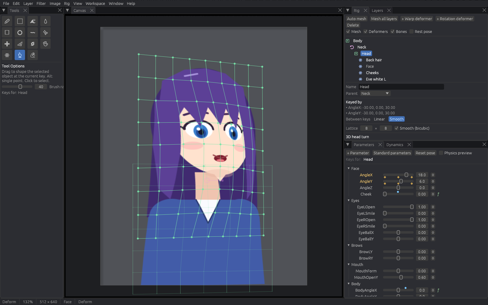
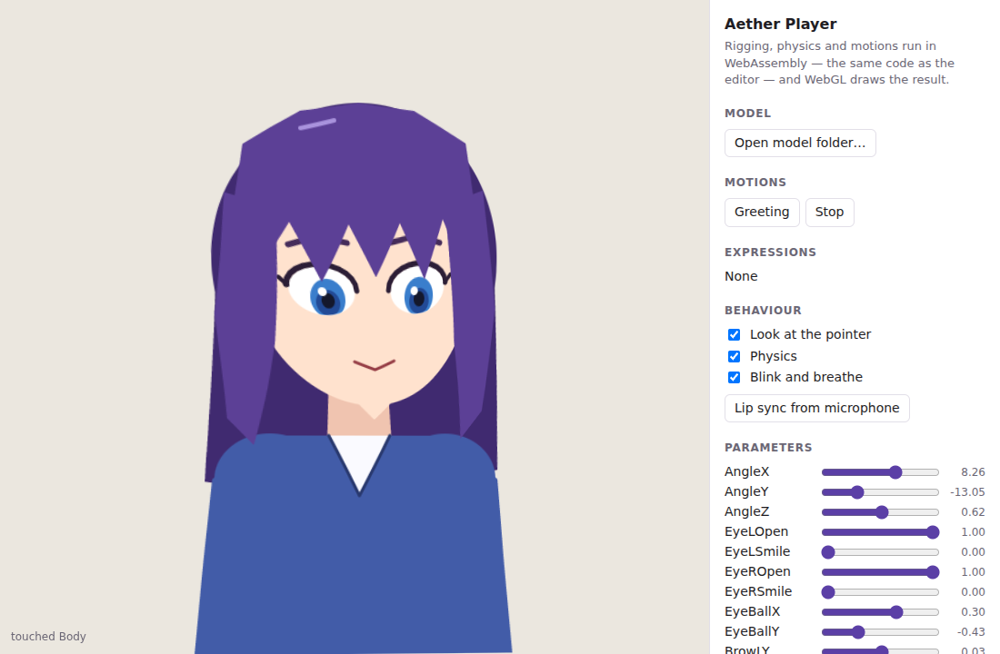
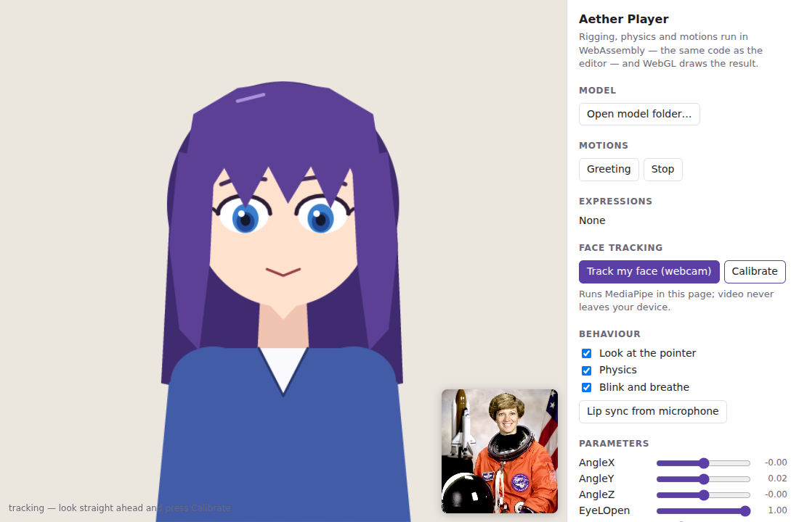

# Aether Canvas

An integrated 2D creative environment written in Rust: painting, pixel art,
vector work, 2D rigging, animation, motion graphics and compositing in one
project, one document model and one timeline.

> **Status: Phases 0–2, 5 and 6 complete.** The application builds, runs, and
> is usable for real raster work *and* for 2D rigging and animation: layers,
> groups, masks, 23 blend modes, a textured brush engine, non-destructive
> effects, transform and liquify — plus a parameter/keyform rig with warp and
> rotation deformers, bones and IK, physics, expression drivers, a timeline,
> lip sync, one-click auto-rigging from layer names, PSD import/export,
> animation export — and a runtime that plays rigged models on the web
> (WebAssembly + WebGL) and natively (C ABI) exactly as the editor does.
> Vector, pixel-art tooling and VFX are designed for but not
> yet implemented — see [ROADMAP.md](ROADMAP.md) for exactly what exists
> today. Nothing in this repository is a mock: if the UI offers it, it works.



## What works today

**Document and layers**
- Raster, group, adjustment, fill and plugin-defined layer types in one tree
- Nested groups, isolated and pass-through blending
- 23 blend modes following the W3C compositing spec
- Per-layer opacity, visibility, lock, transparency lock, clipping and masks
- Non-destructive adjustment layers (levels, curves, hue/saturation, and more)

**Painting**
- Dab-based brush engine with spacing, hardness, flow/opacity separation,
  scatter, jitter, elliptical tips and a stroke stabiliser
- Paper-grain textures and image-stamp (pattern) tips
- Pressure from the pen where the platform reports it, with a speed-based
  fallback and an off switch
- Six built-in presets; save your own, and share them as plain JSON
- Eraser, bucket fill, eyedropper, move, and rectangle/ellipse/lasso/wand
  selection tools

**Non-destructive editing**
- Per-layer effect stack: blur, motion blur, sharpen, glow, drop shadow,
  outline, colour overlay, grain and any colour adjustment — reorderable,
  toggleable, and stored as parameters rather than pixels
- Adjustment layers with a real curve editor (levels, curves, hue/saturation,
  exposure, gamma, colour balance, threshold, posterize and more)
- The same kernels back the destructive Filter menu, so baking an effect gives
  exactly the image you were looking at

**Transforming**
- One transform cage covering scale, rotate, skew, perspective distort and mesh
  warp; Enter applies, Escape abandons, and the whole session is one undo step
- Liquify brush: push, twirl, pinch, bloat and restore

**Rigging and animation** — see [docs/RIGGING.md](docs/RIGGING.md)
- Rig the layers you paint: meshes read their pixels live, so repainting a
  rigged layer needs no re-import
- **✨ Auto rig**: a complete rig — head/body turns, blinking eyes, looking
  irises, brows, mouth, blush, hair physics, breathing, an idle motion — built
  from layer names (English or Japanese) in one undoable step
- Parameters with N-dimensional keyform grids, linear or smooth (C1)
  interpolation, cyclic parameters and additive blend shapes
- Automatic meshing with a coverage guarantee; re-meshing keeps keyforms
- Warp (bicubic) and rotation deformers, glue, jiggle, per-key opacity,
  multiply/screen tint and draw order
- Bones with FK, two-bone and CCD inverse kinematics, and skinning
- Generators: 3D head turn, sway, close, keyform mirroring, standard physics
- Frame-rate-independent pendulum physics with wind, colliders and limits
- Sandboxed expression drivers (`BodyAngleX = self + AngleX * 0.3`)
- Timeline with step/linear/Bézier/ease/back/elastic/bounce/spring keys,
  layered motions with crossfades, expressions, auto-blink, breathing,
  look-at and lip sync baked from WAV
- Rigged layers keep every blend mode, mask, clipping group and effect
- Export GIF, APNG (full colour, soft transparency), PNG sequences and
  sprite sheets; import and export layered PSD
- Import and export Live2D motions (`.motion3.json`) and expressions
  (`.exp3.json`): bring them along, or animate existing Live2D models with
  Aether's timeline
- An honest comparison with Live2D Cubism is in
  [docs/RIGGING.md](docs/RIGGING.md#compared-with-live2d-cubism)

**Runtime** — see [docs/RUNTIME.md](docs/RUNTIME.md)
- Export a runtime model (open JSON + PNG texture atlases) from File ▸
  *Export runtime model…*, or headlessly:
  `aether-canvas --auto-rig --export-model out/ character.psd` turns a PSD
  into a rigged, playable model in one command
- One runtime, `aether-player`, running the editor's own rig code: every rig
  feature — bones and IK, drivers, jiggle, physics, motions, expressions,
  blink, breath, look-at, lip sync, motion events, hit testing — plays back
  identically
- Web player: WebAssembly (≈190 KB gzipped) + WebGL 1/2, a drop-in
  `<canvas>` component with pointer following, tap events and microphone lip
  sync; about 0.8 ms per frame for the demo character
- **Webcam face tracking** built in: head, eyes, blinks, gaze, brows and
  mouth follow your face (MediaPipe, running on the device), mirrored like a
  reflection; any ARKit/MediaPipe-style tracker drives a model through the
  same API on every platform
- A C ABI with a header for native engines and apps, a Rust crate, and a
  software renderer for servers and tests
- Parity-tested: WebGL in headless Chromium and the software renderer
  against the editor's compositor, WebAssembly against native, and a C
  program against the header





*Face tracking in the web player, fed by a fake camera in headless Chromium.
Photo: NASA, public domain.*

**Canvas**
- GPU-accelerated view (wgpu) with pan, zoom, rotation, mirror and a pixel grid
- Tile-based incremental compositing: a brush dab re-composites and re-uploads
  only the tiles it touched

**Editing**
- Every operation is an undoable command, with slider-drag coalescing,
  transactions and a clickable history panel

**Files**
- `.aether` project format: a plain ZIP of JSON + PNG, versioned and migratable
- Import and export PNG, JPEG, WebP, TIFF, BMP and GIF; layered PSD in and out

**UI**
- Dockable, splittable, tabbed panels (drag them anywhere)
- Five workspaces (Illustration, Pixel Art, Compositing, Rigging, Animation)
- Dark, light and high-contrast themes
- English and Japanese (a system CJK font is picked up automatically), with
  no UI strings hard-coded in widget code
- Fully rebindable keyboard shortcuts with conflict detection

## Building and running

Requires a recent stable Rust toolchain (1.82+).

```sh
cargo run --release -p aether-desktop            # start the editor
cargo run --release -p aether-desktop -- art.aether   # open a file
cargo test --workspace                           # run the test suite
```

On Linux the window needs the usual desktop libraries at runtime
(`libxkbcommon`, plus X11 or Wayland client libraries) and a Vulkan- or
GL-capable driver.

### Without a display

The whole imaging pipeline is independent of the window system, so it can be
driven headlessly:

```sh
cargo run -p aether-desktop --example headless_render -- out.png
```

This builds a document in code, paints with the brush engine, composites and
writes both `out.png` and `out.aether`.

```sh
cargo run --release -p aether-desktop --example rig_demo -- demo
cargo run --release -p aether-desktop --example ui_screenshot -- demo/aether-chan.aether rigging shot.png
```

`rig_demo` paints a character, rigs it by hand *and* with Auto rig, animates
it with physics and baked lip sync, and writes GIFs, stills, projects and the
runtime model. `ui_screenshot` renders the editor itself to a PNG in
software — no GPU or display needed.

### The web player

```sh
rustup target add wasm32-unknown-unknown
runtime/web/build.sh --demo            # the WebAssembly module and a demo model
node runtime/web/test/serve.mjs        # open http://localhost:8080/
node --test runtime/web/test/*.test.mjs
```

## Repository layout

```text
crates/
  aether-core/      math, colour, blend modes, ids, errors, input
  aether-raster/    pixel buffers, tiles, compositing kernels, brush engine,
                    textured triangle meshes
  aether-rig/       parameters, keyforms, meshes, deformers, bones, physics,
                    drivers, motions, behaviours, auto-mesh and auto-rig
  aether-document/  layer tree, document model, commands, undo history
  aether-render/    compositor, render cache, viewport maths
  aether-io/        .aether project container, image and PSD import/export,
                    animation and runtime-model export
  aether-player/    the runtime: model format, player, C ABI (also the
                    WebAssembly interface), software renderer
  aether-ui/        panels, tools, docking layout, application shell
apps/desktop/       the binary, plus end-to-end tests and examples
runtime/web/        the JavaScript/WebGL player, demo page and browser tests
runtime/c/          a C example, compiled and run by the test suite
docs/               architecture notes and the file-format specification
```

## Documentation

- [ARCHITECTURE.md](ARCHITECTURE.md) — how the pieces fit together and why
- [ROADMAP.md](ROADMAP.md) — what is built, what is next
- [CONTRIBUTING.md](CONTRIBUTING.md) — conventions and expectations
- [docs/FILE_FORMAT.md](docs/FILE_FORMAT.md) — the `.aether` container
- [docs/RIGGING.md](docs/RIGGING.md) — rigging and animation guide, and the
  comparison with Live2D Cubism
- [docs/RUNTIME.md](docs/RUNTIME.md) — exporting and playing models in games,
  apps and on the web; the model format and the C API

## Licence

Dual-licensed under MIT or Apache-2.0, at your option.
