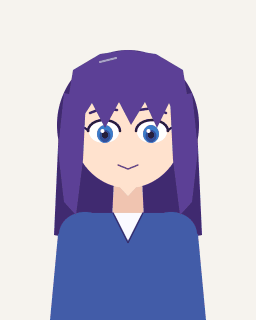
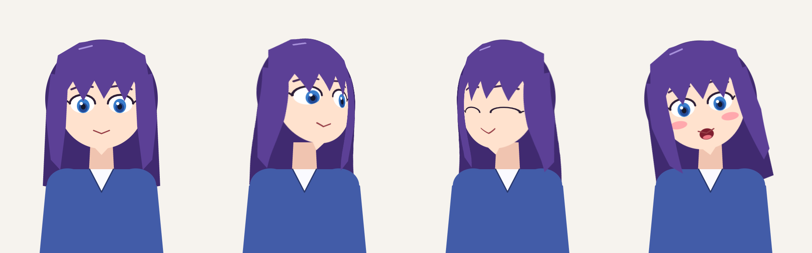
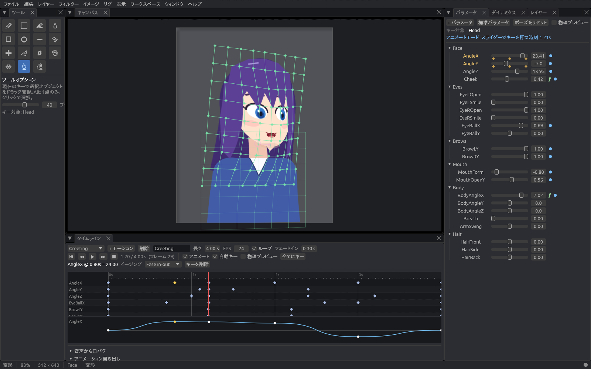

# Rigging and animation

Aether Canvas rigs painted artwork directly: the layers you paint are the
layers that move. There is no export to a separate rigging program, no
texture atlas to rebuild, and no re-import when you fix a stroke — repaint a
rigged layer and the change shows through the deformation immediately.


*The Rigging workspace: the rig hierarchy and inspector (top right), parameter
sliders with key diamonds (bottom right), and the generated head-turn lattice
over the character. Rendered headlessly with `examples/ui_screenshot.rs`.*

## Quick start

1. **Bring in artwork.** Paint it here, or open a layered **PSD** (File ›
   Open): folders, blend modes, clipping, masks and Unicode layer names come
   across.
2. **Auto rig.** Switch to the *Rigging* workspace and press **✨ Auto rig**.
   Every painted layer is meshed, and a complete rig is built from the layer
   names (see [Auto rig](#auto-rig)). It is one undo step.
3. **Pose it.** Drag the parameter sliders. Turn on **Physics preview** to see
   hair swing, eyes blink and the body breathe.
4. **Refine.** Select any object, put its parameter on a key (the slider snaps
   to the ◊ diamonds) and shape it with the **Deform** tool (`W`).
5. **Animate.** In the *Animation* workspace, create a motion, move the
   playhead and drag sliders — with *Auto key* on, every slider move writes a
   key. Press `P` to play.
6. **Export** a GIF, a PNG sequence or a sprite sheet (Rig menu or the
   timeline's Export section), or save the `.aether` project.
7. **Ship it.** File ▸ *Export runtime model…* writes `model.json` and
   texture atlases that the web player and the native runtime play exactly as
   the editor does — see [RUNTIME.md](RUNTIME.md). From a PSD, one command
   does everything: `aether-canvas --auto-rig --export-model out character.psd`.
   For VTube Studio and other Live2D apps, File ▸ *Export Live2D model…*
   writes a Cubism model instead (see [Live2D Cubism models](#live2d-cubism-models)).



*`examples/rig_demo.rs`: a character painted, rigged, animated with a baked
lip-sync track and exported entirely through the public API, with physics
running.*

## Concepts

### Parameters

A parameter is a named number with a range — `AngleX` from −30 to 30,
`EyeLOpen` from 0 to 1. **Everything that moves is a function of
parameters**: keyforms interpolate across them; physics, drivers, behaviours
and motions write them. One currency for pose is what lets all those systems
compose, and it means a motion made for one rig plays on any rig that uses the
same parameter names. **Standard parameters** adds the conventional set
(`AngleX/Y/Z`, `EyeLOpen`, `EyeBallX`, `BrowLY`, `MouthOpenY`, `MouthForm`,
`BodyAngleX`, `Breath`, `HairFront`, …) that trackers and motion libraries
expect.

Parameters may be **cyclic** (a full turn wraps smoothly past the seam).
Moving a slider is posing, not editing: it is not an undo step.

### Keyforms

A *keyform* is a complete shape of one object recorded at one combination of
parameter values. Objects hold an **N‑dimensional grid** of keyforms — any
number of parameters, each with its own keys — and the current shape is
interpolated between the keyforms around the current values:

* **Linear** — multilinear, the familiar behaviour;
* **Smooth** — Catmull‑Rom through the keys, so a head turned through three
  keys follows an arc and motion never "kinks" as it passes a key.

Structural edits never change what you see: inserting a key fills it with the
shape the grid already had there; binding a new parameter copies the current
shapes along it; deleting a parameter keeps the slice at its default.

To edit a keyform, every parameter the object depends on must sit on a key
(the slider snaps within 2.5 % of a key). The parameter panel explains which
parameter is off-key if you try to edit between keys.

**Blend shapes** are additive keyforms on one parameter. They combine with
every other key without multiplying the number of keyforms — a smile that
works at any head angle is one blend shape instead of nine keyforms.

### Meshes

**Auto mesh** triangulates a layer from its alpha: the outline is dilated by a
margin (so triangles never cut anti-aliased edges), boundary and interior
points are placed, Delaunay-triangulated and trimmed to the shape. A coverage
pass guarantees every painted pixel is inside the mesh. The **Mesh** tool
(`U`) adds (click), moves (drag) and deletes (Alt‑click) vertices on the rest
pose; **Re-mesh** at a different density **keeps every keyform, skin weight
and jiggle weight** by interpolating them onto the new vertices.

Each mesh keyform also holds **opacity**, **multiply** and **screen** tint and
a **draw-order** offset, so parts can fade, change colour or move in front of
their siblings under a parameter.

**Glue** holds the seam between two separately meshed parts together.
**Jiggle** turns vertices into damped springs that lag behind the rig —
secondary motion with no keys.

### Deformers

* **Warp** deformers are lattices (bilinear or bicubic). Bicubic warps bend
  curved features without creases along the lattice lines.
* **Rotation** deformers are pivots with angle, scale and offset. They stay
  rigid wherever they sit: inside a warp, the pivot follows the warp and the
  rotation turns with the warp's local direction, but what it carries is
  never stretched or sheared by the lattice — so a head pivoting on a body
  warp moves as a whole. (This is Live2D Cubism's rule too, which is why
  rigs export to Cubism faithfully.)

Deformers nest to any depth; meshes and deformers can also follow a **bone**
rigidly. Drags with the Deform tool are mapped back through every parent, so
a vertex inside a turned head moves exactly where the cursor goes.

### Bones and IK

Bones are drawn with the **Bone** tool (`K`; start on a bone's tail to chain).
Each bone has keyforms (rotation, translation, length), so bones are posed by
parameters like everything else; **Add rotation parameter** makes a
−180…180 parameter that *is* the bone's angle for direct FK animation.
**Inverse kinematics** constraints make a chain reach for a target bone — an
exact analytic solution for two-bone limbs, cyclic coordinate descent for
longer chains, blended with FK by weight. Meshes are **skinned** to bones
with linear blend skinning; **Skin to bones** computes weights automatically.

### Physics

Pendulum chains hang from an anchor that parameters move and tilt; the swing
of a chosen link writes parameters back. The simulation runs at a **fixed
120 Hz step**, so it behaves identically at any frame rate and exports match
playback. Chains have gravity, **wind with gusts**, per-link damping,
**stiffness toward the rest shape** (stiff bangs, loose ponytails), **angle
limits** and **circular colliders**.

### Drivers

A driver computes a parameter from an expression:

```text
BodyAngleX = self + AngleX * 0.3
Cheek      = smoothstep(0.2, 0.9, MouthOpenY) * 0.8
AngleZ     = wiggle(0.4, 3)
```

The language has arithmetic, comparisons, `&& || !`, `? :`, parameter names
(quote names with spaces: `"Hair Front"`), `time`, `self`, `pi`, and `sin cos
tan asin acos atan atan2 sqrt abs floor ceil round fract sign min max clamp
lerp mix smoothstep step pow exp ln log log10 mod remap noise wiggle pingpong
deg rad`. It is **sandboxed**: no loops, assignments or I/O, bounded size and
nesting, and evaluation never fails. Drivers run in dependency order; cycles
are reported, not run.

### Motions

A motion is one track of keyframes per parameter. Each key's easing shapes
the segment after it: **step, linear, cubic Bézier (with overshoot), ease
in/out/in-out, back in/out, elastic, bounce and physically based spring**.
The timeline shows the selected track's curve so easing is visible. The
animator plays motions in layers (override or additive) with crossfades.

**Expressions** are named parameter presets (add, multiply or overwrite)
that fade in and out on top of motions.

### Behaviours

Motion that should never need keys: **auto-blink** (randomised, with double
blinks), **breathing**, **look-at** (follow the pointer in the editor, or any
input in a host application) and **lip sync** (live from an audio level, or
**baked** from a WAV file into editable `MouthOpenY`/`MouthForm` keys with a
brightness estimate separating open and spread vowels).

## Generators

| Generator | What it saves |
| --- | --- |
| **Auto rig** | A whole rig from layer names (below) |
| **3D head turn** | The 3×3 keyforms of a face warp, from an ellipsoid turned in 3D: the middle of the face travels further than the silhouette, the far side compresses — parallax, fold-free up to ~40° |
| **Sway** | A pendulum bend keyed on any parameter (hair, ribbons, tails), anchored at any edge |
| **Close** | A collapse onto a line at the parameter's minimum (eyelids, mouths) |
| **Mirror key** | The opposite key's shape, mirrored, matched vertex-by-vertex even on asymmetric meshes |
| **Standard physics & behaviours** | Hair chains for `HairFront/Side/Back`, blink, breath and look-at on the standard parameters |
| **Skin to bones** | Automatic bone weights |
| **Bone rotation control** | A parameter that is a bone's angle |

## Auto rig

**✨ Auto rig** reads layer names (and the folders around them) in English or
Japanese and builds:

* a **Body** warp inside a **Body tilt** pivot, a **Neck** pivot and a
  **Head** warp, with parts sorted into them;
* a generated **head turn** (`AngleX/AngleY`) and body turn (`BodyAngleX`),
  head tilt (`AngleZ`) and body tilt (`BodyAngleZ`);
* **eyes** that close (`EyeLOpen/EyeROpen`: whites and irises squash, lashes
  drop to a closed line) and **irises** that look (`EyeBallX/Y`);
* **brows** (`BrowLY/BrowRY`), a **mouth** that opens and smiles
  (`MouthOpenY`, `MouthForm`), **blush** that fades in (`Cheek`);
* **hair and accessories** that sway (`HairFront/Side/Back`) with physics;
* **breathing**, **auto-blink**, **look-at**, a body-follows-head **driver**
  and an **Idle** motion.

| Role | Recognised names (case-insensitive, any language mix) |
| --- | --- |
| Face | face, head, skin, tears · 顔, 肌, 輪郭, 頭, 涙, 汗, 頬_通常 |
| Eye white | eye white, sclera · 白目 |
| Iris | iris, pupil, eye highlight · 瞳, 黒目, 虹彩, 目玉, 目hi |
| Lash / lid | lash, eyelid, lid · まつ毛, 睫毛, まぶた, アイライン, 二重 |
| Brow | brow · 眉, まゆ |
| Mouth | mouth, lip · 口, 唇 |
| Mouth inside | mouth open / inside / tongue / teeth · 口 開き, 舌, 歯 |
| Cheek | cheek, blush · 頬, チーク, 赤面, 照れ |
| Bangs | bangs, fringe, front hair · 前髪 |
| Side hair | side hair, sidelock · 横髪, サイド, もみあげ |
| Back hair | back hair, ponytail, twintail · 後ろ髪, ポニー, ツイン, テール |
| Other hair | hair, ahoge · 髪, アホ毛, 生え際 |
| Accessory | ribbon, earring, tail, tie · リボン, イヤリング, ピアス, しっぽ, ネクタイ |
| Body | body, torso, clothes, shirt, dress, skirt, legs · 体, 胴, 服, シャツ, 制服, 上着, 襟, インナー, スカート, 脚, スカーフ |
| Left out | reference, sketch, background, bg · 原画, 下書き, ラフ, 背景 |

Left and right come from the name (`L`, `left`, `左` …) or, failing that,
from the part's position. Unrecognised layers are listed in the status bar
and ride along with their folder.

PSDs split into materials, as Live2D samples come, work as they are:

* **Layers with generic names** (`線`, `塗り`, `影`, `Layer 3`) take the role
  of the innermost folder that has one: `前髪/レイヤー 30` is bangs,
  `耳R/肌` an ear. Folders that gather several kinds of part (a face, a
  body, a whole eye, a mouth) leave their parts' own roles alone.
* **A/B alternatives** (`腕A_L` and `腕B_L`: arms down or crossed) get a
  `Variant` parameter: A shows at 0, B at 1.
* A detail drawn **across both eyes** on one layer follows each eye with the
  half nearer it; unrecognised parts **inside an eye** (clipping masks)
  close with it, and unrecognised parts on the face turn with the head.
* **Lower lashes** stay put while the upper lid comes down to them;
  **double-eyelid lines** move down with the lid, above the closed line.
* **Reference art and backgrounds** are left out of the rig — by name, or
  an unnamed layer covering the whole picture.
* **Layer and folder masks move with the parts they trim**: a face whose
  outline a mask cuts keeps that outline when it turns. The editor draws
  masks this way for every rigged layer, as the runtime model and the
  players always have.

## Samples and ZIP archives

Samples usually arrive zipped — a Live2D sample download holds the runtime
model next to the PSDs it was made from. Aether opens what is inside
without unpacking:

* **File ▸ Open…** accepts a `.zip`: its one model, PSD, project or image
  opens straight away; when it holds several, a window asks which. Archives
  inside archives are looked into, and Japanese file names written by
  Windows (Shift_JIS) read correctly.
* **File ▸ Sample library…** lists everything openable in a folder of
  samples — loose files and the contents of every ZIP in it — with a filter
  and one-click opening, *Auto rig PSDs when opened* included. It looks for
  an `assets_sample` folder in the working folder or beside the application
  (or the `AETHER_SAMPLES` environment variable); *Choose folder…* picks
  another. Big PSDs open on a background thread.
* From the command line, `aether-canvas --list assets_sample` prints each
  item as a path to pass back, such as
  `"assets_sample/pack.zip#runtime/model.model3.json"`; that path opens,
  exports or auto-rigs like any file.



*The demo character rigged by Auto rig from its layer names alone: rest, head
turned with the eyes looking, blink with a smile, head tilt while talking with
blush and raised brows.*

## Animation



*The Animation workspace (Japanese UI): the timeline with keyframe rows, the
selected key's easing, the eased curve under the tracks, and the character
posed from the motion at the playhead.*

* **Animate** mode: the selected motion drives the pose from the playhead,
  and slider moves write keys (with *Auto key*). Rig mode (Animate off): the
  sliders pose the rig for keyform editing.
* Click the ruler to move the playhead, click a diamond to select it, drag it
  to retime, double-click a row to key that parameter. `,` / `.` step frames;
  `P` plays; `Shift+K` keys every parameter.
* **Lip sync**: *Load WAV…* then *Bake lip sync* writes mouth tracks into the
  motion (and lengthens it to fit the audio).
* **Export**: GIF (flattened over the document background), PNG sequence, or
  a sprite sheet with a JSON atlas; physics can run during export after a
  warm-up so chains start settled.

## Live2D Cubism models

Aether reads and writes Live2D Cubism models, so a character can move
between the two, and anything rigged in Aether can be used in VTube Studio,
nizima LIVE and apps built on the Cubism SDKs.

### Opening a Live2D model

**File ▸ Open Live2D model…** (or *Open…*, or dropping a `.model3.json`,
`.moc3` or model folder) opens a Cubism model as a document. It is drawn
exactly as Cubism Core draws it — deformation, masks, blend modes, culling —
and checked against Cubism Core itself on Live2D's sample models. Its
parameters (with their display names), parts, pose groups, hit areas,
motions, expressions, blinking and lip sync become ordinary rig parameters
and animation, and its physics runs as the Cubism Framework runs it. From
there you can animate it on Aether's timeline, add and edit motions and
expressions, drive it with face tracking, and export it again.

### Exporting a Live2D model

**File ▸ Export Live2D model…** asks for a folder and writes a complete
Cubism model into it:

```text
NAME.model3.json    the model settings (what apps open)
NAME.moc3           the model
NAME.2048/          texture pages (power-of-two squares)
NAME.physics3.json  physics
NAME.cdi3.json      parameter and part display names
motions/            one .motion3.json per motion ("Idle…" motions form the Idle group)
expressions/        one .exp3.json per expression
```

Blinking and lip sync are declared in the model settings, so the Cubism
SDK's eye-blink and lip-sync helpers (and VTube Studio) drive the right
parameters. When the export finishes, a window lists anything that was
approximated or left out. Headlessly:
`aether-canvas --auto-rig --export-live2d out character.psd` goes from a
PSD to a Cubism model in one command.

**An opened Live2D model** is written back as it came — the `.moc3` and
textures byte for byte — with the motions, expressions, pose groups, hit
areas, parameter ranges and display names as edited in Aether.

**A document rigged in Aether** becomes a new Cubism model:

* The hierarchy carries over: warps become warps, rotations become
  rotations, and **bones become nested rotation deformers** (a bone's
  children turn about its head, as a rotation's turn about its pivot).
  Layer groups become parts, clipping becomes masks, and draw order, glue,
  opacity and multiply/screen tint carry over.
* Every object's keyforms are **sampled from Aether's own evaluation** on a
  grid over the parameters it depends on, and a key is added wherever
  Cubism's straight-line interpolation between keys would stray from what
  Aether draws. So smooth (Catmull-Rom) key interpolation, blend shapes,
  skinning and inverse kinematics all come across, as extra keyforms.
  Smooth (bicubic) warps become bilinear warps on a finer lattice — finer
  still where rotations inside them carry artwork far from their pivot.
* The model is then **evaluated the way Cubism Core does and compared with
  the editor**, vertex by vertex, at the defaults, at each parameter's
  extremes and at random poses. The largest difference is reported; an
  auto-rigged test character stays within a pixel. Parts that differ by
  more than a few pixels are named.
* **Physics** chains are translated (the same inputs, particles and
  outputs) and then fitted: Aether's simulation and Cubism's are played the
  same head movements, and Cubism's delay, mobility, acceleration, output
  gain and directions are chosen to match. The two integrate differently,
  so the sway is close rather than identical, and the export says so when
  the difference is noticeable. Colliders, wind and angle limits have no
  Cubism equivalent and are listed.
* **Drivers** are not part of Cubism models. By default the driven
  parameter becomes an ordinary parameter (VTube Studio and the Cubism SDK
  samples drive `BodyAngleX` and the like from tracking themselves), and
  every exported motion gets the driven curves the editor would play. The
  library option `bake_drivers` folds drivers into the keyforms instead, at
  the cost of much larger files.
* Jiggle, breathing and look-at are left to the app; screen blending needs
  the Cubism 5.3 format (`Live2DExportOptions::version`), otherwise it is
  drawn as add.

The `.moc3` is the runtime format that apps load, not a Cubism Editor
project (`.cmo3`), which keeps editing data the runtime format does not
have.

### Motions and expressions on their own

Aether's standard parameters are Live2D's without the `Param` prefix
(`AngleX` ↔ `ParamAngleX`), and expressions blend the same three ways, so
Live2D motions (`.motion3.json`) and expressions (`.exp3.json`) also move
between rigs individually:

* **Import** (*Import Live2D…* in the Timeline, *Import .exp3.json…* under
  Expressions) brings motions and expressions along when a character moves
  to Aether. Curves for parameters the rig lacks, and part-opacity curves,
  are listed rather than guessed at.
* **Export** (*Export .motion3.json…*, and *Export* next to each expression)
  lets Aether's timeline animate existing Live2D models: elastic, bounce and
  spring keys, and lip sync baked from a WAV file, play in any app that plays
  Live2D motions.

Linear, stepped and Bézier segments translate exactly, and so do Aether's
ease-in/out and back keys (they are cubic). Elastic, bounce and spring keys
become runs of Bézier segments within 0.2% of the curve. Custom parameters
keep their names.

## Keyboard shortcuts

| Key | Action |
| --- | --- |
| `U` | Mesh tool |
| `W` | Deform tool |
| `K` | Bone tool |
| `P` | Play / pause |
| `,` `.` | Previous / next frame |
| `Shift+K` | Key all parameters |
| `Shift+P` | Physics preview |
| `Shift+R` | Reset pose |

All shortcuts are rebindable (Help › Keyboard Shortcuts).

## Using the rig from code

The rig is plain data with pure evaluation, in its own crate with no GPU or
window dependency:

```rust
use aether_document::rig::{Rig, RigRuntime};

let pose = doc.rig.evaluate();          // deterministic: values in, geometry out
let mut runtime = RigRuntime::new();     // time: motions, behaviours, physics
runtime.play(&doc.rig, 0);
runtime.tick(&mut doc.rig, 1.0 / 60.0);  // writes simulated values
let frame = Compositor::new().render(&doc);
```

`examples/rig_demo.rs` builds, rigs, animates and exports a character this
way; `examples/ui_screenshot.rs` renders the editor itself without a GPU.

## Compared with Live2D Cubism

Live2D Cubism is the established tool for this kind of 2D rigging, and
Aether Canvas deliberately keeps its core model — parameters, keyforms, warp
and rotation deformers — because it works. The table is our honest reading
of where each stands.

| | Aether Canvas | Live2D Cubism |
| --- | --- | --- |
| Painting and rigging | **One application**: rig the layers you paint; repaint while rigged with no re-import | Artwork prepared in an external painting tool, imported as PSD; changes need re-import |
| Import | Layered **PSD** (folders, blend modes, clipping, masks, Unicode names) and images; PSD export | PSD import |
| Getting started | **✨ Auto rig from layer names** (EN/JA): full rig with physics, behaviours and an idle motion in one step | Templates and assisted face-motion generation for some parts |
| Meshes | Automatic from alpha with a **coverage guarantee**; **re-meshing keeps keyforms**, skin and jiggle weights; manual editing | Automatic and manual meshing |
| Keyform grid | **Any number of parameters**, linear or **smooth (C1) interpolation**, cyclic parameters, additive blend shapes | Multi-parameter keyforms (linear), blend shapes |
| Deformers | Warp (**bicubic** or bilinear) and rotation (rigid, as in Cubism), nested; **drag mapping through deformed parents** | Warp (Bézier) and rotation, nested |
| Head turn | **Generated 3D ellipsoid turn**, fold-free, 3×3 keys with smooth interpolation | Manual keyforms or face-motion generation |
| Bones | **Skeleton with FK, analytic two-bone IK, CCD IK, linear blend skinning, automatic weights** | No skeletal bones or IK |
| Per-key appearance | Opacity, multiply and screen tint, draw order | Opacity, multiply and screen tint, draw order |
| Glue | Yes | Yes |
| Blend modes and effects | **23 blend modes, clipping, masks, groups, adjustment layers and non-destructive effects** (blur, glow, shadow, outline…) all apply to rigged layers | A smaller set of blend modes and clipping masks |
| Physics | Verlet chains, **fixed 120 Hz step (frame-rate independent)**, gravity, **wind with gusts**, stiffness, **angle limits, colliders** | Pendulum physics with inputs and outputs |
| Secondary motion | **Per-vertex jiggle** springs | Via physics groups |
| Parameter logic | **Sandboxed expression drivers** with dependency ordering | — |
| Motions | Step, linear, Bézier, ease, back, **elastic, bounce, spring** keys; layered animator with crossfades; expressions | Linear/Bézier/stepped curves; expressions; pose groups |
| Procedural motion | Auto-blink, breathing, **look-at**, lip sync (live or **baked from WAV** with vowel brightness) | Blink, breath and lip sync via the SDK framework; lip sync from audio |
| Undo | **Every rig edit undoable**, slider drags coalesce, posing kept out of history | Undo in the editor |
| Export | GIF, **APNG (full colour, soft transparency)**, PNG sequence, **sprite sheet + JSON atlas**, PSD, runtime model, open project; **video (WebM, transparent) recorded straight from the web player** | Video, GIF, image sequence, runtime model |
| Pipeline | **PSD → rigged, playable model in one command** (`--auto-rig --export-model`), no window needed | Exported from the editor |
| File format | **Open**: project and runtime model are documented JSON + PNG | Proprietary binary runtime format |
| Runtime | **One open-source runtime running the editor's own rig code**: WebAssembly + WebGL 1/2 for the web (≈190 KB gzipped, ~0.8 ms per frame for the demo character), a C ABI for native hosts, a Rust crate, a software renderer. Every rig feature above plays back (bones and IK, drivers, jiggle, glue, physics, motions, behaviours), parity-tested against the editor; effects and masks are baked into textures and blend modes map to normal, multiply, screen and add | **Mature official SDKs** for Unity, native C++, web and Java |
| Engine integration | **A Godot 4 package** (the `AetherModel2D` node: rig, motions, expressions, look-at, lip sync, face tracking, hit testing, clipping and every blend mode, tested in Godot with all three renderers); **a Unity package** (the `AetherModel` component; its C# binding tested with .NET, its scripts compiled against Unity's assemblies, not yet run inside Unity); any engine through the C ABI; a wgpu renderer for Rust engines | **Official packages for Unity and native engines**; no official Godot package |
| Editor preview | Poses and playback drawn on the GPU whenever that is exact (checked against the CPU compositor); the full compositor otherwise | GPU |
| Live2D files | **Opens Live2D models** (drawn exactly as Cubism Core draws them, physics as the Cubism Framework runs it) to animate, edit and export again; **exports rigs made in Aether as Cubism models** (.moc3, physics, motions, expressions) for VTube Studio and the Cubism SDKs, checked against Cubism's own evaluation | — |
| Face tracking | **Built into the runtime**: webcam tracking in the web player (MediaPipe, on the device), and one API for any ARKit/MediaPipe-style tracker, mapped identically on every platform | Through third-party apps (VTube Studio and others) |
| Ecosystem | New | **Large**: tracking apps, tutorials, marketplaces |
| Price | **Free and open source** (MIT / Apache-2.0) | Free tier with limits; paid Pro licence |

Where Live2D still leads is maturity and ecosystem: a Unity SDK proven in
production, years of production use, and the tracking software,
tutorials and model marketplaces built around it. In the editor and the rig
model, Aether Canvas offers more: an integrated painting pipeline, bones and
IK, expression drivers, generators and auto-rigging, a far richer
compositing model, frame-rate-independent physics and an open format. Its
runtime is newer, but it is free, open, and runs the editor's own rig code
on the web and natively, so every rig feature plays back exactly as it was
authored.

## 日本語での概要

Aether Canvas は、描いたレイヤーをそのまま動かせる 2D リギング／アニメーション機能を備えています。

* **PSD を開く → ✨自動リグ → スライダーで確認 → 変形ツールで調整 → タイムラインでアニメーション → GIF／APNG（フルカラー・半透明対応）／PNG 連番／スプライトシート書き出し**、がすべて一つのアプリで完結します。Web プレイヤーからは透過対応の WebM 動画も録画できます。
* **自動リグ**はレイヤー名（顔・白目 左・瞳・まつ毛・眉・口・頬・前髪・横髪・後ろ髪・体 など。英語名も可）から、顔の向き（3D 楕円体による自動生成）・まばたき・視線・眉・口の開閉と笑顔・頬染め・髪揺れ物理・呼吸・待機モーションまでを一度に作ります（1 回の「元に戻す」で取り消せます）。Live2D のサンプルのような**素材分け PSD** にも対応し、「前髪/線」のようにフォルダ名から役割を判断、「腕A_L／腕B_L」の差分は `Variant` パラメータで切り替え、両目にまたがるレイヤーは頂点ごとに近い方の目に追従、下まつげ・二重線・クリッピング用レイヤーも適切に動かし、原画や背景はリグから外します。レイヤーマスクやフォルダのマスクは、動かしたパーツと一緒に移動します（顔の輪郭をマスクで整えた PSD でも、振り向いたときに穴が開きません）。
* **ZIP とサンプルライブラリ**：「ファイル ▸ 開く…」で ZIP を選ぶと、中の Live2D モデル・PSD・プロジェクト・画像を展開せずに直接開けます（複数あるときは選択ウィンドウ。ZIP 内の ZIP、Windows の日本語ファイル名（Shift_JIS）にも対応）。「ファイル ▸ サンプルライブラリ…」では `assets_sample` フォルダ（作業フォルダかアプリと同じ場所、または環境変数 `AETHER_SAMPLES`）の中身を ZIP の中まで一覧し、クリックで開けます。「PSD を開いたら自動リグ」も選べます。コマンドラインでは `aether-canvas --list assets_sample` で一覧し、表示されたパス（`"assets_sample/pack.zip#runtime/model.model3.json"` など）をそのまま開く・書き出す・自動リグに使えます。
* Live2D と同じ「パラメータ＋キーフォーム＋ワープ／回転デフォーマ」を土台に、**ボーンと IK・式ドライバ・スムーズ補間・ブレンドシェイプ・ぷるぷる揺れ（ジグル）・フレームレート非依存の物理（風・コライダー・角度制限）・23 種の合成モード＋エフェクト**を追加しています。
* 保存形式は JSON と PNG の ZIP で、仕様を公開しています。
* **ランタイム**：「ファイル ▸ ランタイムモデルを書き出し…」で model.json とテクスチャアトラスを出力し、Web（WebAssembly + WebGL、gzip 約 190 KB）、C ABI 経由のネイティブ環境、Rust で再生できます。エディタと同じリグのコードが動くため、見た目も動きもエディタと一致します（自動テストで検証済み）。PSD からは `aether-canvas --auto-rig --export-model 出力先 character.psd` の 1 コマンドで、リグ付きの再生可能なモデルになります。
* **Godot 4 パッケージ**：`AetherModel2D` ノードを置いて model.json を指定するだけで再生できます。モーション・表情・視線追従・口パク・フェイストラッキング・当たり判定を GDScript から操作でき、クリッピングと 4 種の合成モードも含めて Godot の 3 つのレンダラーすべてでソフトウェアレンダラーと同じ絵になることを Godot 上の自動テストで確認しています（Live2D には公式の Godot パッケージがありません）。
* **Live2D モデルの読み込みと書き出し**：「ファイル ▸ Live2D モデルを開く…」で Cubism モデル（.model3.json）を開くと、Cubism Core と同じ変形・マスク・合成で表示され（Live2D のサンプルモデルで Cubism Core 本体と照合済み）、パラメータ・パーツ・モーション・表情・物理演算をそのまま編集・再生できます。「ファイル ▸ Live2D モデルを書き出し…」では、開いた Live2D モデルを編集内容込みで書き戻せるほか、**Aether でリグを組んだキャラクターを新しい Cubism モデル（.moc3・.model3.json・物理演算・モーション・表情）として書き出し**、VTube Studio や nizima LIVE、Cubism SDK で使えます。ボーンは入れ子の回転デフォーマに変換され、スムーズ補間やスキニングはキーフォームを自動で追加して再現します。書き出し後は Cubism と同じ計算でエディタとの差を頂点ごとに検証し、近似した点を一覧で表示します（自動リグしたテストキャラクターでは誤差 1 px 未満）。物理演算は Cubism 側の設定をエディタの揺れに合わせて自動調整しますが、計算方式が異なるため完全には一致しません。PSD からは `aether-canvas --auto-rig --export-live2d 出力先 character.psd` の 1 コマンドで Cubism モデルになります。
* **Live2D のモーションと表情**：Live2D のモーション（.motion3.json）と表情（.exp3.json）を単体でも読み込み・書き出しできます。標準パラメータ名は Live2D の `Param` を除いたもの（`AngleX` ↔ `ParamAngleX`）なので、そのまま対応します。Aether のタイムライン（弾性・バウンス・スプリングのキー、WAV からの口パク焼き込み）で既存の Live2D モデル用のモーションを作ることもできます。
* **フェイストラッキング**：Web プレイヤーにウェブカメラでの顔トラッキングを内蔵しています（MediaPipe をブラウザ内で実行し、映像は外部に送信しません）。首の向き・傾き、まばたき、視線、眉、口の開閉と笑顔がモデルに反映され、既定では鏡像として動きます。ARKit など他のトラッカーも同じ API で使えます。
* **Unity パッケージ**：`AetherModel` コンポーネントで再生できます（C# バインディングは .NET 上でネイティブライブラリと突き合わせてテスト済み、スクリプトは Unity のアセンブリに対してコンパイル確認済み。Unity 本体での描画はまだ未検証です）。
* 一方、実績のある Unity SDK や、トラッキングアプリ・チュートリアル・モデル販売などのエコシステムでは Live2D が先行しています。
