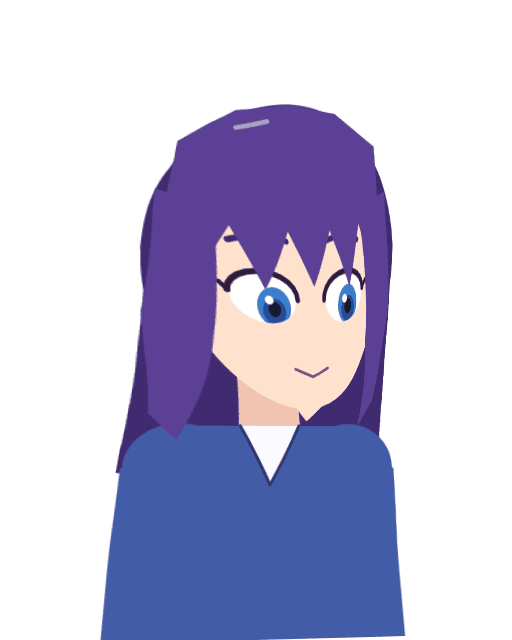

# Runtime: playing models in games, apps and on the web

A rigged character is only useful if it can leave the editor. Aether Canvas
exports a **runtime model** — `model.json` plus PNG texture atlases — and
ships **one runtime, `aether-player`**, that plays it everywhere:

| Host | How | Status |
| --- | --- | --- |
| Web pages | `runtime/web/aether-player.js` + `aether_player.wasm` (≈190 KB gzipped), WebGL 1 or 2 | Tested in headless Chromium against the software renderer |
| Godot 4.2+ | `runtime/godot`: the `AetherModel2D` node (a GDExtension), scripted from GDScript | Tested in Godot 4.3: logic headless, and drawing with all three renderers (Compatibility, Forward+, Mobile) against the software renderer |
| JavaScript without a DOM | `AetherRuntime` / `AetherModel` from the same file | Tested in Node |
| C, C++ and anything with a C FFI (C# / Unity P/Invoke, Swift, Kotlin/JNI, Python ctypes…) | The `aether_player` shared library and `include/aether_player.h` | `runtime/c/play.c` is compiled against the header and run by `cargo test` |
| Rust | The `aether-player` crate | Tested |
| Rust engines on wgpu (Bevy and others), any Vulkan/Metal/DX12/GL/WebGPU app | `aether-player-wgpu`: `GpuPlayer::prepare` + `paint` into your render pass, or `render` into a texture | Checked against the software renderer on Mesa's Vulkan driver |
| Servers, thumbnails, CI | `aether_player::cpu`, a software renderer | The reference the others are checked against |

The player runs **the same rig code as the editor** — keyforms, deformers,
bones and IK, glue, jiggle, pendulum physics, expression drivers, motions,
expressions, blinking, breathing, look-at and lip sync — so a model moves in
a game exactly as it did on the canvas. There is no second implementation to
drift out of step.


## Exporting

* **Editor:** File ▸ *Export runtime model…*, then pick a folder.
* **Command line** (no window; for build pipelines):

  ```sh
  aether-canvas --export-model out/model character.aether
  aether-canvas --auto-rig --export-model out/model character.psd   # PSD → rigged model
  ```

* **Rust:** `aether_io::runtime_model::export_model_to_dir(&doc, dir, &Default::default())`.

The export writes `model.json` and `texture_0.png`, `texture_1.png`, …
Editor-only features are resolved on the way out, and anything approximated
is reported (in the status bar, on the command line, or in
`ModelExport::warnings`):

| In the editor | In the runtime model |
| --- | --- |
| Raster layers with a mesh | Parts drawing that mesh |
| Raster layers without a mesh | Rectangles around their pixels |
| Fill layers | Rectangles sampling a 4×4 block of the colour |
| Layer masks, effects | Baked into the part's pixels |
| Clipping layers | Parts clipped to their base (the base's opacity folds in) |
| Groups | Kept for draw-order sorting; their opacity, blend mode and transform fold into the parts inside (exact unless children of a translucent group overlap) |
| Normal, multiply, screen, add | The same |
| Other blend modes | The nearest of those four, with a note |
| Adjustment and plugin layers | Left out, with a note |
| Hidden layers | Left out |
| Painted pixels outside a mesh | Not drawn (the editor shows them at rest); reported so you can re-mesh |

Texture atlases are packed into roughly square pages of at most 4096 pixels,
with a transparent gutter around every part so filtering never bleeds.

## The model format

`model.json` (version 1) is plain JSON:

```jsonc
{
  "format": "aether-model",
  "version": 1,
  "name": "character",
  "width": 512, "height": 640,           // canvas size, document pixels
  "textures": [{ "file": "texture_0.png", "width": 636, "height": 772 }],
  "parts": [{
    "layer": 7,                           // links the part to its rig mesh
    "name": "Face",
    "texture": 0,
    "vertices": [x0, y0, x1, y1, …],      // rest positions, document pixels
    "uvs": [u0, v0, u1, v1, …],           // 0..1, v down
    "triangles": [a, b, c, …],            // vertex indices, three per triangle
    "opacity": 1.0,
    "blend": "normal",                    // normal | multiply | screen | add
    "transform": { "a": 1, "b": 0, "c": 0, "d": 1, "tx": 0, "ty": 0 }  // optional
  }],
  "tree": [                               // draw order, bottom first
    { "kind": "part", "index": 0, "part": 0 },
    { "kind": "part", "index": 1, "part": 4, "clipped": [5] },
    { "kind": "group", "index": 2, "name": "Hair", "children": [ … ] }
  ],
  "rig": { … }                            // parameters, deformers, bones, meshes,
                                          // physics, drivers, motions, expressions,
                                          // behaviours — as in project.json
}
```

Keyed draw-order offsets sort siblings by `index + offset`, exactly as the
editor's compositor does, so a part can move in front of another mid-motion.
Loading validates every index; a damaged file is rejected with a reason,
never half-drawn.

## Playing a model

Every host follows the same loop: set inputs, **tick**, then draw the
**draw list**.

```rust
use aether_player::Player;

let mut player = Player::from_json(&std::fs::read_to_string("model/model.json")?)?;
player.play_motion(player.motion_index("Idle").unwrap(), false);
player.look_at(Some((0.3, 0.1)));          // -1..1, y up
player.set_audio(voice_level, 0.0);        // lip sync
let angle = player.parameter_index("AngleX").unwrap();
player.set_parameter(angle, face_tracker_yaw);

player.tick(dt);                           // motions, behaviours, drivers, physics
for event in player.events() { /* motion events: sounds, cues */ }
for item in player.draw_list() {
    let part = &player.model().parts[item.part as usize];
    let positions = player.positions(item.part as usize); // x/y pairs, document px
    // draw part.triangles with part.uvs from texture page part.texture,
    // using item.opacity, item.multiply, item.screen, item.blend_kind(),
    // clipped to item.mask_part() when set
}
```

Inputs:

* **Parameters** — set any parameter's base value (from face tracking, a
  game, a slider). Motions, expressions, behaviours, drivers and physics
  layer on top, in that order.
* **Motions** — `play_motion(i, additive)` crossfades overriding motions or
  layers additive ones; `stop_motions()` fades out. Timeline events fire
  through `events()`.
* **Expressions** — `set_expression(Some(i))` fades one in, `None` out.
* **Look-at and lip sync** — `look_at(Some((x, y)))` and
  `set_audio(level, brightness)`. They switch the behaviour on the first time
  input arrives, whatever the model had saved.
* **Stages** — `set_stage(Stage::Physics, false)` and friends.
* **Hit testing** — `hit_test(x, y)` returns the topmost visible part under
  a document point, for tap reactions.

### Face tracking

Any face tracker that reports head angles and the 52 standard blend shapes
(ARKit on iPhones, MediaPipe in browsers, most VTuber tracking apps) drives
a model through one call:

```rust
use aether_player::FaceFrame;
let mut face = FaceFrame { yaw, pitch, roll, ..Default::default() };
face.set_shape("jawOpen", 0.4);
face.set_shape("eyeBlinkLeft", 0.9);
player.track_face(&face);      // every tracker frame
player.calibrate_tracking();   // "this is my neutral face"
player.tick(dt);               // smoothing happens here
```

Frames use the tracked person's frame of reference, as trackers report
them: yaw toward their left, pitch up, roll toward their left shoulder, and
`…Left` shapes belong to their left side. The player maps them onto the
standard parameters (`AngleX/Y/Z`, `EyeBallX/Y`, `EyeL/ROpen`, `EyeL/RSmile`,
`BrowL/RY`, `MouthOpenY`, `MouthForm`, and the body following the head
unless a driver already does), smoothed, measured against the calibrated
neutral face, and mirrored by default so the model moves like the person's
reflection. Auto-blink pauses while the eyes are tracked. The web player's
`aether-tracking.js` does all of this from a webcam with MediaPipe; the C API
has `aether_player_track_face` and friends.

### Drawing rules

Textures are straight-alpha PNGs. Premultiply on upload and blend
premultiplied:

| Blend | Colour factors (src, dst) | Alpha factors |
| --- | --- | --- |
| normal | `ONE`, `ONE_MINUS_SRC_ALPHA` | same |
| multiply | pass 1: `DST_COLOR`, `ONE_MINUS_SRC_ALPHA` (alpha untouched: `ZERO`, `ONE`); pass 2: `ONE_MINUS_DST_ALPHA`, `ONE` | pass 2: `ONE`, `ONE_MINUS_SRC_ALPHA` |
| screen | `ONE`, `ONE_MINUS_SRC_COLOR` | `ONE`, `ONE_MINUS_SRC_ALPHA` |
| add | `ONE`, `ONE` | `ONE`, `ONE_MINUS_SRC_ALPHA` |

Multiply takes two passes because premultiplied multiply is
`Cs·Cd + Cs·(1−αd) + Cd·(1−αs)`; one pass is enough over opaque artwork.

Tint applies to straight colour before opacity: `rgb = rgb·multiply`, then
`rgb = rgb + screen − rgb·screen` (premultiplied: `rgb·multiply`, then
`+ screen·a − rgb·screen`). A draw item with a mask is drawn only where the
mask part's alpha (times `mask_opacity`) is: render the mask part's alpha
into an offscreen target and multiply by it, as `WebGLRenderer` does.

## The C API

Build the shared library and include the header:

```sh
cargo build --release -p aether-player
# target/release/libaether_player.so / .dylib / aether_player.dll
cc runtime/c/play.c -I crates/aether-player/include -L target/release -laether_player -o play
LD_LIBRARY_PATH=target/release ./play model/model.json
```

[`runtime/c/play.c`](../runtime/c/play.c) is a complete, commented example.

```c
#include "aether_player.h"

AetherPlayer *p = aether_player_new(json, json_len);   /* NULL + aether_last_error() on failure */
aether_player_play_motion(p, 0, 0);
int32_t angle = aether_player_parameter_find(p, (const uint8_t *)"AngleX", 6);

/* every frame */
aether_player_set_parameter(p, angle, yaw);
aether_player_tick(p, dt);
const AetherDrawItem *items = aether_player_draw_items(p);
for (uint32_t i = 0; i < aether_player_draw_count(p); i++) {
    const float *xy = aether_player_part_positions(p, items[i].part);
    /* uvs and indices never change: aether_player_part_uvs / _indices */
}
aether_player_free(p);
```

Every function accepts NULL handles and out-of-range indices and does
nothing; nothing panics across the boundary. Strings come back as
pointer + length and are NUL-terminated. The full list, with ownership rules,
is in [`include/aether_player.h`](../crates/aether-player/include/aether_player.h).

## The web player

See [runtime/web/README.md](../runtime/web/README.md). In short:

```js
import { AetherPlayer } from './aether-player.js';
const player = await AetherPlayer.load(canvas, 'model/model.json');
player.playMotion('Idle');
player.followPointer();
player.lipSync(await navigator.mediaDevices.getUserMedia({ audio: true }));
player.start();
```

## Godot

See [runtime/godot/README.md](../runtime/godot/README.md). Copy
`addons/aether/` into a project, add an `AetherModel2D` node, point its
**Model Path** at `model.json`, and script it:

```gdscript
model.play_motion("Idle", false)
model.look_toward(Vector2(0.3, 0.1))
model.track_face(yaw, pitch, roll, {"jawOpen": 0.4, "eyeBlinkLeft": 1.0})
if model.hit_test(model.get_local_mouse_position()) == "Face":
    model.set_expression("Smile")
```



## How it is kept honest

* `aether-io` exports a scene that uses every export path (a rigged mesh
  keyed for movement, opacity, tint and draw order; a clipping layer; a
  translucent group; multiply; a mask; a hidden layer), plays it with the
  player, and requires the software render to match the editor's compositor
  at several poses. On the demo character the largest difference is one
  colour level.
* The web tests pose the demo character in WebAssembly and require every
  vertex to match the native player within 0.001 px; then headless Chromium
  draws each pose with WebGL 1 and WebGL 2 and compares against the software
  renderer (mean difference about 0.01 levels; the rare larger ones are single
  pixels on degenerate slivers, where GPUs snap vertices to 1/256 px).
* In Godot 4.3, `runtime/godot/test.sh` exercises the node's API headless,
  then draws the demo character and a fixture with every drawing path. The
  fixture has clipping to a fading, tinted mesh, plus multiply, screen, add
  and translucency. Each renderer (Compatibility, Forward+, Mobile) must
  match the software renderer, and the mean difference is at most 0.13
  levels.
* An end-to-end test turns a PSD into a model with the real
  `aether-canvas --auto-rig --export-model` binary and plays it.
* Face tracking is checked where it shows: on an auto-rigged face, turning,
  tipping, winking and calibrating move the drawn parts the right way on
  screen, mirrored and not; and in headless Chromium, MediaPipe tracks a real
  photo of a face turned ±20° on screen and the model tilts to match (roll
  measured within a degree of the turn).
* `cargo test` compiles `runtime/c/play.c` against the header with
  `-Wall -Wextra -Werror`, links it to the shared library and checks what it
  prints, so the header, the exported symbols and the struct layout cannot
  drift apart.
